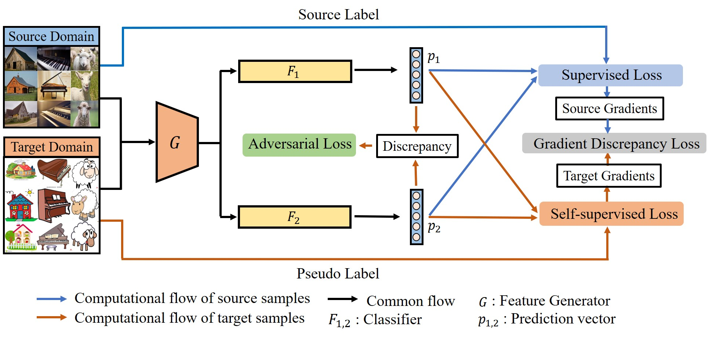

# Cross-Domain Gradient Discrepancy Minimization for Unsupervised Domain Adaptation
A Pytorch implementation of Cross-Domain Gradient Discrepancy Minimization for Unsupervised Domain Adaptation. **CVPR 2021** 

Zhekai Du, Jingjing Li, Hongzu Su, Lei Zhu, Ke Lu

## Introduction
-----------------------------------------
Unsupervised Domain Adaptation (UDA) aims to generalize the knowledge learned from a well-labeled source domain to an unlabeled target domain. Recently, adversarial domain adaptation with two distinct classifiers (bi-classifier) has been introduced into UDA which is effective to align distributions between different domains. Previous bi-classifier adversarial learning methods only focus on the similarity between the outputs of two distinct classifiers. However, the similarity of the outputs cannot guarantee the accuracy of target samples, i.e., target samples may match to wrong categories even if the discrepancy between two classifiers is small. To challenge this issue, in this paper, we propose a cross-domain gradient discrepancy minimization (CGDM) method which explicitly minimizes the discrepancy of gradients generated by source samples and target samples. Specifically, the gradient gives a cue for the semantic information of target samples so it can be used as a good supervision to improve the accuracy of target samples. In order to compute the gradient signal of target samples, we further obtain target pseudo labels through a clustering-based self-supervised learning. Extensive experiments on three widely used UDA datasets show that our method surpasses many previous state-of-the-arts.

  

    
## Environment

1. Linux Ubuntu 18.04   

2. python=3.6  

3. pytorch=1.6.0  

4. torchvision= 0.7.0

5. CUDA = 9.2

6. GPU = RTX 2080Ti (video memory >= 11G)

## Results

synthetic to real: 76.4% (SWD) ~ 82.3% (Ours)  

## How to run?

1. Open a terminal or put it into a pycharm project. 
2. Put the dataset into the correct path. 
3. Run train_visda.py

## Citation
If you find the code useful in your research, please consider citing:

    @InProceedings{cross21,
      author = {Du, Zhekai and Li, Jingjing and Su, Hongzu and Zhu, Lei and Lu, Ke},
      title = {Cross-Domain Gradient Discrepancy Minimization for Unsupervised Domain Adaptation},
      booktitle = {The IEEE Conference on Computer Vision and Pattern Recognition (CVPR)},
      month = {June},
      year = {2021}
    }

-------------------------------------------
### FAQ
Please create a new issue

